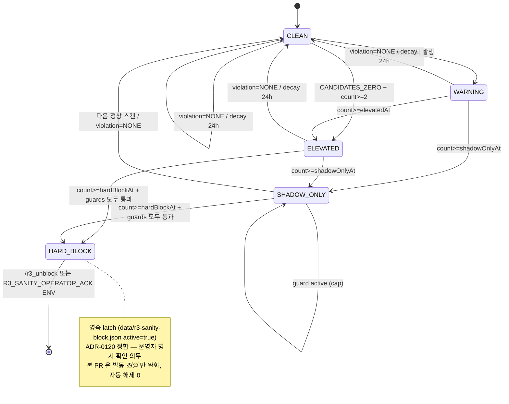

# ADR-0401 — R3 Sanity Violation State Machine (단계형 위반 누적)

@responsibility R3 Sanity Block 발동 조건을 *1회 발생 즉시 hard latch* → *5단계 누적 + 시간 decay + Regime-Aware Threshold + Guard 체인* 으로 격상.

## 컨텍스트

ADR-0120 (PR-B) 가 R3 sanity check 를 도입했고 ADR-0195 (PR #621) 가 텔레그램 즉시 해제 명령 (`/r3_unblock`) + `/guards` 8번째 가드 가시화 + cooldown 24h 를 추가했지만 *발동 로직 자체* 에 결함 잔존:

1. **단일 스캔 1회 위반 → hard block latch** — `scanDiagnostics.ts:340-359` 가 `GATE1_PASS_ZERO` / `CANDIDATES_ZERO` 발생 즉시 `activateR3SanityBlock()` 호출 → `data/r3-sanity-block.json` 영속 latch 생성 → 다음 cron tick 부터 신규 매수 영구 차단 (운영자 `/r3_unblock` 또는 `R3_SANITY_OPERATOR_ACK` ENV 까지).
2. **시장 정상 + 일시적 데이터 결함 시 false positive 위험** — Yahoo 일시 timeout, KIS 401 재시도, MTAS 단발성 결손 → Gate 1 통과 일시 0 → R3_EARLY 같은 *허용적 레짐* 도 즉시 차단.
3. **Regime-Aware 부재** — R3_EARLY (회복 초기, 변동성 큼) 와 R3_CONFIRMED / R3_EXPANSION (안정 상승) 모두 동일 임계 (1회 발생 = 차단). R3_EARLY 는 더 관대해야 한다.
4. **데이터 품질 / 시스템 결함 미분리** — `sectorEnergyDataQuality=DEGRADED|FAILED` (ADR-0396) / `marketDataFreshness=EXPIRED` / `volumeClock` 비허용 / `gatePassDistribution` 부재 같은 *정상적인 시스템 비활성화* 도 위반으로 누적.
5. **streak 무한 누적 위험** — 1회 발생 후 별도 reset 없으면 다음 날·다음 주 동일 위반 발생 시 자동 누적 → 부정확한 hard block 트리거.

본 PR 은 R3 Sanity *자체* 는 유지 (사용자 명시 절대 원칙 #1) + 발동 조건만 단계형으로 격상한다. 이미 active 인 latch 는 자동 해제 금지 (절대 원칙 #11/12).

## 결정

### 1. R3 Violation State 5단계 union (CLEAN → WARNING → ELEVATED → SHADOW_ONLY → HARD_BLOCK)

```typescript
export type R3ViolationState =
  | 'CLEAN'         // 위반 없음 / streak=0
  | 'WARNING'       // 1회 발생 — 진단 텔레그램만 (latch 없음)
  | 'ELEVATED'      // 2회 누적 — 강화 진단 텔레그램만 (latch 없음)
  | 'SHADOW_ONLY'   // 3회 누적 (R3_EARLY 외) 또는 guard 차단 — 신규 실매수 차단 + shadow learning 유지 (ephemeral)
  | 'HARD_BLOCK';   // 5회 (R3_EARLY) / 3회 (그 외) 누적 + guards 모두 통과 — 영속 latch 생성 (ADR-0120 정합)
```

### 2. R3SanityAction 5단계 union

```typescript
export type R3SanityAction =
  | 'NONE'              // 위반 없음 — 정상 진행
  | 'WARNING_ONLY'      // 텔레그램 진단만, 매매 흐름 영향 0
  | 'ELEVATED_ALERT'    // 텔레그램 강화 진단만
  | 'SHADOW_ONLY_BLOCK' // 신규 진입 차단 + shadow learning 유지 (ephemeral, 다음 정상 스캔 → CLEAN 자동 회복)
  | 'HARD_BLOCK_LATCH'; // r3-sanity-block.json active=true 영속 (ADR-0120 정합 — /r3_unblock 까지 유지)
```

### 3. Regime-Aware Threshold SSOT

`server/trading/signalScanner/r3SanityProfiles.ts`:

```typescript
export const R3_SANITY_PROFILES = {
  R3_EARLY: {
    warningAt: 1,
    elevatedAt: 2,
    shadowOnlyAt: 3,
    hardBlockAt: 5,
    minCandidatesForHardBlock: 5,
  },
  R3_CONFIRMED: {
    warningAt: 1,
    elevatedAt: 2,
    shadowOnlyAt: 2,
    hardBlockAt: 3,
    minCandidatesForHardBlock: 5,
  },
  R3_EXPANSION: {
    warningAt: 1,
    elevatedAt: 2,
    shadowOnlyAt: 2,
    hardBlockAt: 3,
    minCandidatesForHardBlock: 5,
  },
  DEFAULT: {
    warningAt: 1,
    elevatedAt: 2,
    shadowOnlyAt: 2,
    hardBlockAt: 3,
    minCandidatesForHardBlock: 5,
  },
} as const;
```

R3_EARLY 는 변동성 큼 → 5회 연속 (사용자 절대 원칙 #4) 까지 hard block 유보. 다른 R3 변형은 더 안정적 → 3회 연속에서 hard block.

### 4. Guard 체인 (5종 OR — 1건이라도 true 면 hardBlockAllowed=false)

```typescript
guard.candidates < profile.minCandidatesForHardBlock              // 절대 원칙 #6
guard.sectorEnergyDataQuality ∈ {DEGRADED, FAILED}                // ADR-0396 정합
guard.marketDataFreshness === 'EXPIRED'                            // ADR-0190 정합
guard.volumeClockAllowsEntry === false                             // 절대 원칙 #7
guard.gatePassDistributionFresh === false                          // 절대 원칙 #8
```

5종 모두 false (= 정상 시스템 상태) 일 때만 HARD_BLOCK 격상. 한 건이라도 true 시 SHADOW_ONLY 까지만 cap.

### 5. 결정 트리 우선순위 (state machine 본체)

```
violation === 'NONE'
  → CLEAN / NONE / streak reset

violation === 'GATE_PASS_DATA_MISSING'
  → WARNING / WARNING_ONLY / hardBlockAllowed=false (절대 원칙 #8)

violation === 'CANDIDATES_ZERO'
  → WARNING (count<elevatedAt) 또는 ELEVATED (count≥elevatedAt) / hardBlockAllowed=false
  (universe / 워치리스트 결함 — 시스템 결함 명시, hard block 도달 부적합)

violation === 'GATE1_PASS_ZERO':
  guard 평가 (5종 OR)
  if (anyGuardActive) hardBlockAllowed = false
  if (count < profile.warningAt)        → CLEAN / NONE
  else if (count < profile.elevatedAt)  → WARNING / WARNING_ONLY
  else if (count < profile.shadowOnlyAt) → ELEVATED / ELEVATED_ALERT
  else if (count < profile.hardBlockAt) → SHADOW_ONLY / SHADOW_ONLY_BLOCK
  else if (hardBlockAllowed === false)  → SHADOW_ONLY / SHADOW_ONLY_BLOCK (cap)
  else                                  → HARD_BLOCK / HARD_BLOCK_LATCH
```

### 6. Streak 영속 + 24h decay

`server/persistence/r3ViolationStreakRepo.ts`:

```typescript
export interface R3ViolationStreakState {
  schemaVersion: 1;
  violation: R3SanityViolationType | 'NONE';
  regime: string;
  consecutiveCount: number;
  firstSeenAt: string;     // ISO
  lastSeenAt: string;      // ISO
  scanIds: string[];       // 마지막 N개 scanId — 중복 증가 차단
}
```

`updateR3ViolationStreak(input)` 결정 트리:

1. ENV `R3_VIOLATION_STREAK_DECAY_HOURS` (default 24, ADR-0157 정확 비교 + NaN/0/음수 → default 24)
2. `lastSeenAt` 부재 OR `(now - lastSeenAt) > decayHours` → consecutiveCount 0 + firstSeenAt=now (decay)
3. `scanId` 가 `state.scanIds` 마지막 값과 동일 → 변경 없음 (중복 증가 차단)
4. `state.violation !== input.violation` OR `state.regime !== input.regime` → consecutiveCount=1 (다른 위반 시작)
5. 그 외 (같은 violation+regime, 다른 scanId, decay 안 지남) → consecutiveCount += 1

### 7. SHADOW_ONLY 정의 (옵션 C — Watch-only entry, 절대 원칙 #10)

- 현재 스캔의 신규 실매수 진입 차단 (preflight return shouldAbort=true)
- shadow learning 유지 — `recordBlockedDayShadowScan('R3_SANITY_BLOCK')` 호출 (기존 reason 재사용)
- **`activateR3SanityBlock()` 호출 금지** (data/r3-sanity-block.json active=true 저장 금지)
- 다음 정상 스캔 (위반 NONE 또는 decay) 에서 자동 CLEAN 회복 가능
- `/r3_unblock` 불필요 — ephemeral

### 8. preflight latch 저장 정책 (절대 원칙 #11/12)

- `state.action === 'HARD_BLOCK_LATCH'` 일 때만 `activateR3SanityBlock()` 호출
- WARNING/ELEVATED/SHADOW_ONLY 는 latch 저장 0
- **이미 active 인 latch (ADR-0120 정합)** — 진입부 `loadR3SanityBlockState().active` 체크 그대로 보존, 자동 해제 도입 금지. 본 PR 은 *새 latch 발동 완화* 만, 기존 active latch 동작 변경 0.

### 9. Telegram dedupeKey 정책 (state별 + count별 분리)

`r3_sanity:<state>:<KST_DATE>:<consecutiveCount>` 형식. 같은 날 다른 단계 (예: WARNING → ELEVATED → SHADOW_ONLY) 알림 정상 발송 + 같은 단계 + 같은 날 + 같은 count 는 24h cooldown 으로 중복 차단.

### 10. /r3_unblock + /r3_status 변경

- `/r3_unblock` (ADR-0195 보존) — `acknowledgeR3SanityBlock('telegram_operator')` 호출 후 *추가* `resetR3ViolationStreakState()` 호출. 운영자가 latch 해제 시 streak 도 0 으로 리셋해 다시 누적 시작 (절대 원칙 #15 정합).
- 신규 `/r3_status` (선택 A 채택) — read-only riskLevel=0 ADMIN. 현재 streak / state / action / guards / latch 상태 통합 조회.

### 11. ENV 정확 비교 (ADR-0157 정합)

- `R3_VIOLATION_STREAK_DECAY_HOURS` — Number 변환 + NaN/0/음수 → default 24
- 별도 disable ENV 없음 — *완화* 정책 (default ON). 회귀 발견 시 `R3_VIOLATION_STREAK_DECAY_HOURS=0` 설정 시 매번 streak reset → ADR-0120 단일 발생 즉시 차단 동작 복원 (effective rollback).

## 안전 invariant 15종 (사용자 절대 원칙 직접 매핑)

1. R3 Sanity Check 자체 유지 (제거 0).
2. `evaluateR3Sanity` 의 `GATE1_PASS_ZERO` 분기 무시 0 — 본 PR 은 분기 결과를 state machine 입력으로 사용, 분기 자체 변경 0.
3. 단일 스캔 1회 위반 → hard block latch 생성 0 (모든 profile 의 hardBlockAt ≥ 3).
4. R3_EARLY profile 의 hardBlockAt=5 — 다른 R3 보다 관대 (사용자 절대 원칙 #4).
5. Guard 체인 5종 OR — sectorEnergy DEGRADED/FAILED + freshness EXPIRED + candidates<5 + volumeClock false + GPD missing/stale 모두 hardBlock 차단.
6. profile.minCandidatesForHardBlock=5 — candidates<5 시 hardBlock 도달 0.
7. volumeClockAllowsEntry=false 시 hardBlock 도달 0.
8. gatePassDistributionFresh=false 시 hardBlock 도달 0.
9. `R3_VIOLATION_STREAK_DECAY_HOURS` default 24 — 무한 누적 차단.
10. SHADOW_ONLY ephemeral — `activateR3SanityBlock()` 호출 0.
11. 이미 active 인 HARD_BLOCK latch — 자동 해제 0 (loadR3SanityBlockState().active 체크 그대로 보존).
12. 본 PR 의 새 latch 발동 완화 — 기존 active latch 자동 해제 0.
13. **LIVE 주문 함수 / KIS 주문 함수 / order executor 수정 0** (절대 규칙 #2/#3/#4 정합).
14. `/r3_unblock` 기능 유지 — `acknowledgeR3SanityBlock` 호출 보존 + streak reset 추가만.
15. `R3_SANITY_OPERATOR_ACK` ENV 정책 유지 (preflight.ts:172 분기 그대로).

## 잘못된 해결 방법 영구 차단 6종

1. **R3 sanity check 자체 제거** — 절대 원칙 #1 위반.
2. **streak persistence 신규 모듈 통합 (예: ghostPortfolio · failurePatterns 영속에 추가)** — 단일 책임 위반, drift 위험. 별도 SSOT 모듈 의무.
3. **HARD_BLOCK 도달 후 자동 해제 (예: 24h timeout)** — 절대 원칙 #11/12 위반, ADR-0120 운영자 명시 확인 정책 위반.
4. **scanId 부재 시 매번 streak +1** — 같은 스캔 사이클 내 중복 호출 시 인플레이션 위험. scanIds[] 마지막 값 비교 의무.
5. **Profile 임계 ENV 화** — 정책 SSOT 분산, drift 위험. 임계 변경은 ADR 갱신 + 회귀 테스트 의무.
6. **dedupeKey 단순화 (state 단계 분리 안 함)** — WARNING → ELEVATED → SHADOW_ONLY 단계 전이 알림이 24h cooldown 에 묻혀 운영자 인지 부담 ↑. state별 분리 의무.

## 회귀 테스트 ≥26 케이스

- `r3ViolationStateMachine.test.ts` ≥20 케이스 — 결정 트리 분기 (CLEAN / WARNING / ELEVATED / SHADOW_ONLY / HARD_BLOCK) × profile 별 (R3_EARLY 5회 / R3_CONFIRMED 3회 / DEFAULT 3회) × guard 5종 (단일 활성 / 다중 활성 / 모두 비활성) + boundary 정합 + 정적 grep 가드 (KIS 주문 함수 import 0).
- `r3ViolationStreakRepo.test.ts` — atomic write tmp→rename / decay 24h boundary / scanId 중복 방지 / violation+regime 변경 reset / JSON corruption fallback / ENV `R3_VIOLATION_STREAK_DECAY_HOURS` 정확 비교 + NaN/0/음수 fallback / 빈 파일 fallback.
- `r3SanityCheck.test.ts` — 본 PR 의 분기 변경 0 (기존 12 케이스 무회귀).
- `r3SanityBlockWiring.test.ts` — wiring 정합 (state.action='HARD_BLOCK_LATCH' 일 때만 activateR3SanityBlock 호출 / WARNING/ELEVATED/SHADOW_ONLY 시 호출 0 정적 grep 가드).
- `r3UnblockAdr0195.test.ts` — `/r3_unblock` 실행 시 `resetR3ViolationStreakState()` 추가 호출 정합 + 기존 동작 무회귀.
- `r3Status.test.ts` — `/r3_status` SSOT 출력 + 메타데이터 (riskLevel=0 ADMIN read-only).

## Mermaid State Diagram



## Guard 평가 순서 SSOT

```
1. minCandidatesForHardBlock — candidates < 5 시 hardBlockAllowed=false (정상 시스템 비활성)
2. sectorEnergyDataQuality — DEGRADED/FAILED 시 hardBlockAllowed=false (ADR-0396 정합)
3. marketDataFreshness — EXPIRED 시 hardBlockAllowed=false (ADR-0190 정합)
4. volumeClockAllowsEntry — false 시 hardBlockAllowed=false (정상 시스템 비활성)
5. gatePassDistributionFresh — false 시 hardBlockAllowed=false (절대 원칙 #8)

OR 결합 — 1건이라도 true 면 SHADOW_ONLY 까지만 cap.
```

## 운영자 활성화 절차

본 PR 머지 직후 자동 활성화 (default ON, ENV 추가 설정 0). Railway 배포 완료 후:

```
/r3_status      → 현재 streak / state / guards / latch 통합 조회
/guards         → 8번째 라인 (R3 sanity block) 활성 시 latch 차단 중
/r3_unblock     → latch 해제 + streak 0 reset (다음 cron tick 부터 신규 매수 재개)
```

회귀 발견 시 ENV `R3_VIOLATION_STREAK_DECAY_HOURS=0` 설정 → 매번 streak reset → ADR-0120 단일 발생 즉시 차단 동작 effective rollback.

## 결과

1. R3 단일 스캔 1회 위반 → hard block 영구 차단 결함 차단 — 5단계 누적 + Regime-Aware Threshold + Guard 체인 + 24h decay 4중 안전망.
2. 시장 정상 + 일시 데이터 결함 (Yahoo timeout / KIS 401 / MTAS 단발 결손) false positive 영구 차단.
3. R3_EARLY 더 관대 (5회) — 회복 초기 변동성 보존.
4. 데이터 품질 / 시스템 결함 분리 — sectorEnergy DEGRADED + freshness EXPIRED + volumeClock + GPD missing 모두 hardBlock 차단.
5. WARNING → ELEVATED → SHADOW_ONLY 단계 전이 알림 — 운영자가 *어느 단계* 에서 어떤 위반인지 즉시 인지.
6. ADR-0120 영속 latch 정책 보존 — 자동 해제 0, /r3_unblock + ENV ACK 만 해제.
7. ADR-0195 텔레그램 즉시 해제 명령 + /guards 가시화 보존 — 본 PR 은 *발동 조건 완화* 만.
8. `/r3_status` 신규 — read-only 통합 진단 (별도 명령으로 운영자 인지 부담 분산).

## 별칭 정책 (ADR-0159)

번호 0401 — 충돌 부재 (다음 발급 SSOT). 별칭 부여 0.

## 후속 PR (scope 외)

- 운영 데이터 1주 누적 후 profile 임계 재조정 (R3_EARLY 5→4 등) — 별도 ADR + 회귀 테스트.
- GatePassDistribution staleness 정확 임계 (현재 fresh: 산출 직전 스캔에서 GPD ≠ undefined) — `gatePassDistributionFresh` 입력 정의 격상 후속.
- streak repo 의 scanId 영속 상한 (현재 마지막 1건만) — 디버깅용 scan history append 후속.
